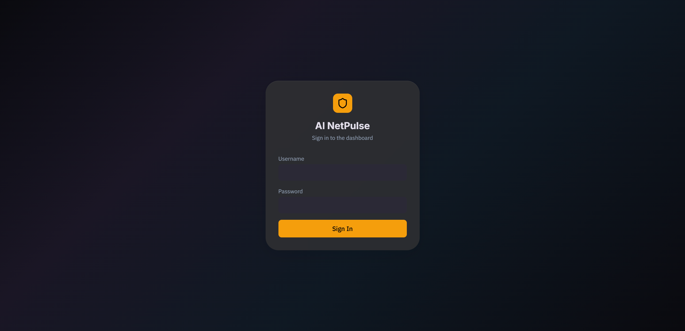
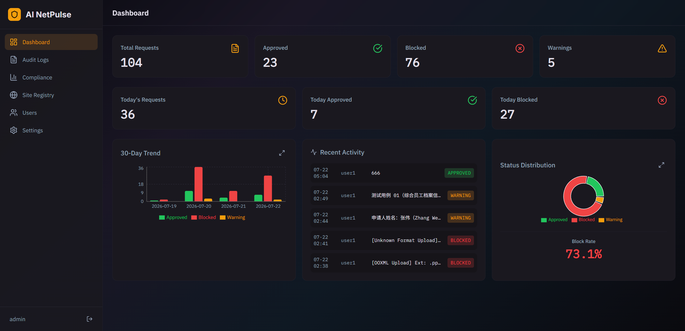
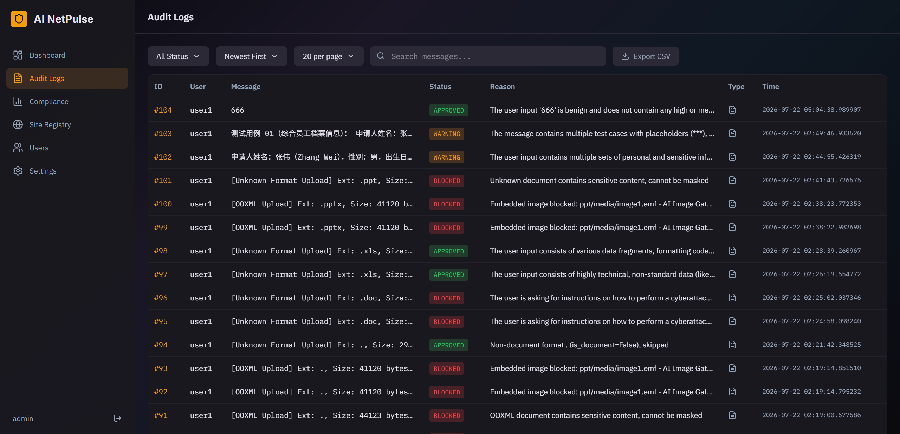
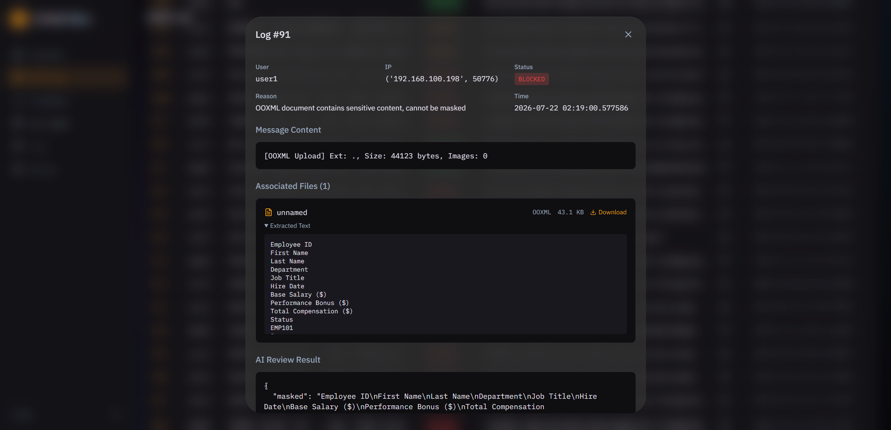
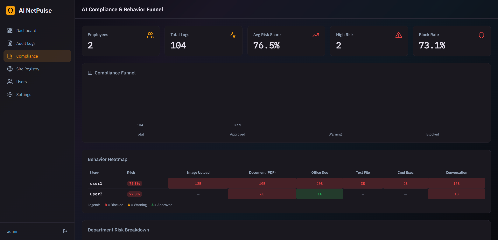
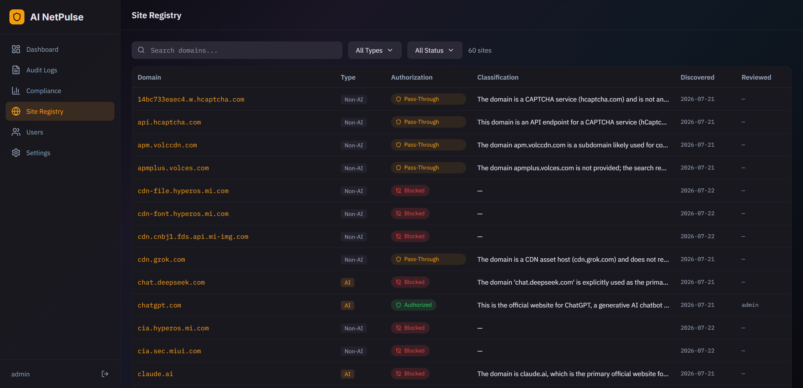
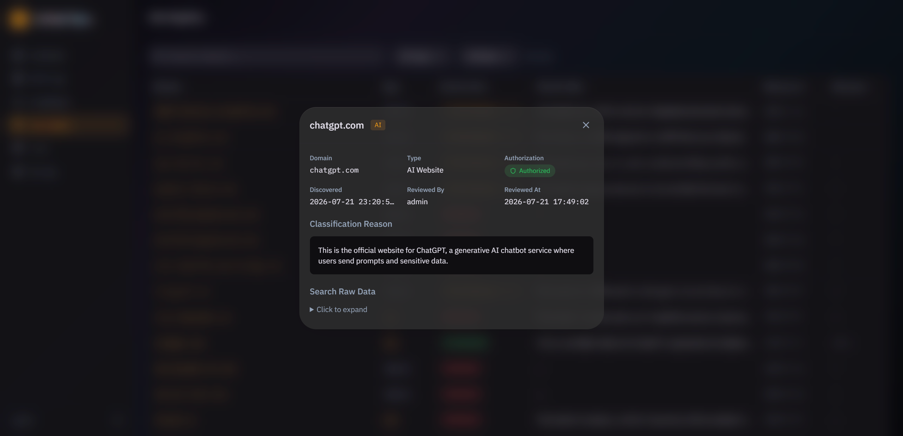
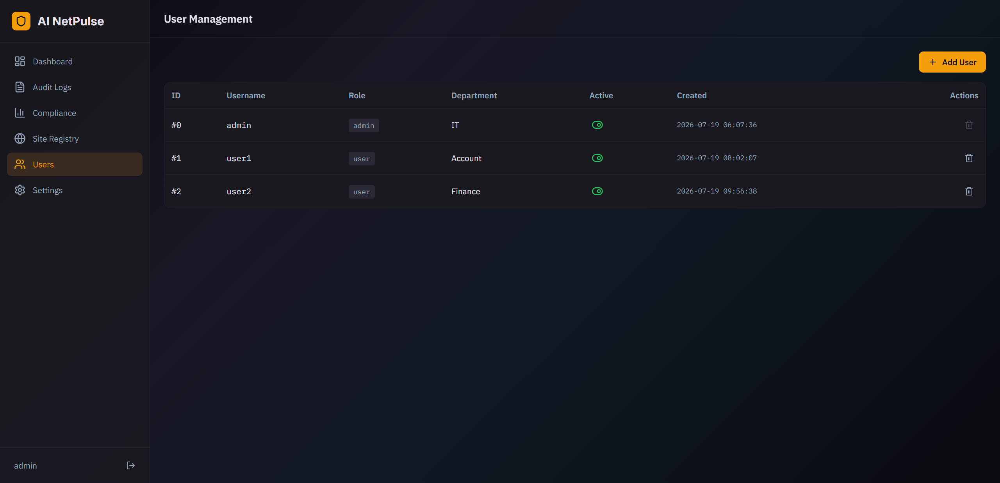

# AI NetPulse

Mitmproxy-based AI traffic auditing and dashboard system. Intercepts ChatGPT/API traffic, evaluates content via local AI, and provides a web dashboard for review.

**Currently supporting chatgpt.com only for demo purposes**

## Credit
[@Cloudy0717](https://github.com/Cloudy0717)
<br>
[@twhannn](https://github.com/Cloudy0717)

## [Online Demo](https://online-demo-five.vercel.app/)
username/password: (any/any)

## TODO List
| Function |  |
|----------|--|
| Traffic Interception & Routing | ✅ |
| Dynamic Whitelisting | ✅ |
| Unauthorized AI Injection & Admin Notification | ✅ |
| Local AI Content Analysis | ✅ |
| Auto-Blocking & Data Sanitization | ✅ |
| Full-session Logging for Audits | ✅ |
| Mandatory Proxy Authentication | ✅ |
| Unauthorized AI Injection & Admin Notification | ✅ |
| AI automatically analyzes chatbot websites |  |
| Screen Watermarking |  |
| Restricted Wi-Fi Zone |  |
| Dashboard | ✅ |

## Prerequisites
| System | Tested |
| :--- | :---: |
| Ubuntu 24.04.4 | ✅ |
| Windows 10 (1809) or later | ✅ |
| macOS | ❓ *(Not tested yet)* |

| Dependency | Version |
|-----------|---------|
| [Python](https://www.python.org/downloads/release/python-3120/)    | 3.12.x   |
| [Node.js](https://nodejs.org/en/download/current)   | 18+     |
| npm       | 9+      |
| [LM Studio](https://lmstudio.ai/download) | any |

**After install LM Studio you need to turn on Local Server**

## Quick Start
Video: [YouTube](https://youtu.be/VbnR5COULeo)

### 1. Clone & setup

```bash
git clone https://github.com/chenxi1227/AI-NetPulse.git && cd AI-NetPulse/
```

**Linux / macOS:**
```bash
bash Linux_start.sh
```

**Windows:**
Just double-click "Windows_start.bat"

This will:
- Check Python and Node versions
- Create `.env` files from examples
- Install Python dependencies
- Install frontend dependencies (npm install)
- Initialize SQLite database with admin account

### 2. Configure

Edit `.env` with your API keys:

```env
# 0 = using LM Studio
# 1 = using online API AI
use_online = "0"

local_api_url = "http://127.0.0.1:1234/v1"         #Change to your LM Studio server IP

online_api_url = "https://opencode.ai/zen/v1"      #Support to OpenAI SDK
ONLINE_API_KEY = "your-key"
online_model = "model"
```

### 3. Run
**Linux / macOS:**
```bash
bash Linux_start.sh
```

**Windows:**
Just double-click "Windows_start.bat"


### 4. Access

| Service | URL |
|---------|-----|
| Dashboard | http://localhost:5173 |
| Proxy | localhost:8080 |

*refer to the console

Default login: `admin` / `admin`

- **Role-Based Access Control (RBAC):**
  - `admin`: Bypasses all validation checks and security auditing.
  - `user`: Every action is strictly tracked, recorded, and audited by the system.
  - *Note: Only `admin` has permission to access the dashboard.*

## Notes

- mitmproxy requires the proxy to be configured on the client device (CA certificate installation for HTTPS inspection)
- after connect to proxy open [mitm.it](http://mitm.it) on browser and install the CA certificate
- The proxy runs on port 8080 by default

- First time run vite on Windows may need a period of time
```bat
[vite] (client) [optimizer] bundling dependencies...
```

### Legacy Office Format Support (.doc/.xls/.odt)

Modern formats (.docx/.pptx/.xlsx) are handled by Python libraries directly. For legacy formats, LibreOffice is used:

- **Linux:** `sudo apt install libreoffice-headless`
- **macOS:** `brew install libreoffice`
- **Windows:** Download [LibreOffice Portable](https://portableapps.com/apps/office/libreoffice_portable) and extract to `libreoffice/` in the project directory (auto-detected). Or install normally.
- **Not installed:** Legacy formats will be skipped silently; all other features work normally.

## Screenshots








